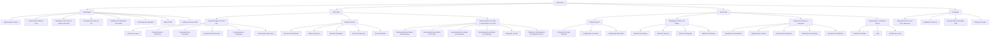

```mermaid
flowchart TD
    Root["SubTracker"]

    Root --> P["Prototipagem"]
    Root --> CS["Client-Side"]
    Root --> SS["Server-side"]
    Root --> F["Finalização"]

    %% Prototipagem
    P --> P1["Organização de ideias"]
    P --> P2["Descrição do Business Case"]
    P --> P3["Definição do Processo de Negócio Principal"]
    P --> P4["Descrição dos casos de uso"]
    P --> P5["Definição dos Requisitos Funcionais"]
    P --> P6["Priorização dos Requisitos"]
    P --> P7["Matriz CRUD"]
    P --> P8["Protótipo das telas HTML"]

    %% Client-Side
    CS --> CS1["Componentização do Front-end"]
    CS --> CS2["Criação de Rotas"]
    CS --> CS3["Gerenciamento de estado e comunicação com a API"]

    CS1 --> CS1a["Estrutura e Layout"]
    CS1 --> CS1b["Componentes de Assinatura"]
    CS1 --> CS1c["Componentes de Cobranças"]
    CS1 --> CS1d["Componentes de Serviços"]
    CS1 --> CS1e["Componentes de Categorias"]
    CS1 --> CS1f["Componentes Financeiros"]

    CS2 --> CS2a["Rota inicial / Dashboard"]
    CS2 --> CS2b["Rotas de Serviços"]
    CS2 --> CS2c["Rotas de Categorias"]
    CS2 --> CS2d["Rotas de Cobranças"]
    CS2 --> CS2e["Rota de Relatório"]

    CS3 --> CS3a["Gerenciamento dos Dados de Assinaturas"]
    CS3 --> CS3b["Gerenciamento dos Dados de Serviços"]
    CS3 --> CS3c["Gerenciamento dos Dados de Categorias"]
    CS3 --> CS3d["Gerenciamento dos Dados de Cobranças"]
    CS3 --> CS3e["Integração com API"]
    CS3 --> CS3f["Tratamento de Estados de Carregamento e Erro"]

    %% Server-side
    SS --> SS1["Estrutura da API"]
    SS --> SS2["Modelagem do Banco de Dados"]
    SS --> SS3["Criação dos Serviços e operações"]
    SS --> SS4["Autenticação e controle de Acesso"]

    SS1 --> SS1a["Estrutura do Projeto Backend"]
    SS1 --> SS1b["Configuração do Servidor"]
    SS1 --> SS1c["Configuração das Rotas"]

    SS2 --> SS2a["Tabela de Assinaturas"]
    SS2 --> SS2b["Tabela de Serviços"]
    SS2 --> SS2c["Tabela de Categorias"]
    SS2 --> SS2d["Tabela de Cobranças"]

    SS3 --> SS3a["Operações de Assinaturas"]
    SS3 --> SS3b["Operações de Serviços"]
    SS3 --> SS3c["Operações de Categorias"]
    SS3 --> SS3d["Operações de Cobranças"]
    SS3 --> SS3e["Operações de Relatórios"]

    SS4 --> SS4a["Cadastro de Usuário"]
    SS4 --> SS4b["Login"]
    SS4 --> SS4c["Controle de Acesso"]

    %% Finalização
    F --> F1["Integração do Front-end com o Back-end"]
    F --> F2["Validação do Sistema"]
    F --> F3["Entrega da Documentação Final"]
    F --> F4["Entrega do Projeto"]
```