# EAP - SubTracker

**Versão:** 3.0  
**Data:** 03/10/2026

## 1. Escopo da EAP

A EAP decompõe as **entregas** do SubTracker (produto e projeto). Ela não contém datas, horas nem custos; esses dados ficam no Dicionário da EAP. O estado considerado é o do repositório em 03/10/2026: front-end em React funcionando com `json-server`; back-end real, banco de dados e autenticação robusta ficam para a etapa seguinte (`documentacao/Cronograma.md`).

**Dentro do escopo:** UC01–UC04, UC06, UC09–UC11, UC13–UC14 (somente CSV), UC17 e UC18, mais o back-end real, a autenticação segura, a integração, os testes, a publicação gratuita e a documentação final.

**Fora do escopo (decisões documentadas):**

- UC05, UC07 e UC08 (administração do catálogo de serviços): `Refinamento_da_Prototipagem_SubTracker.md`, seção 4.
- UC15 e UC16 (histórico e descarte de lançamentos): mesma seção.
- UC12 como exclusão literal: a meta é zerada.
- Importação OFX: o repositório só aceita CSV.
- Integração direta com bancos e cancelamento automático no provedor.

## 2. Estrutura analítica (árvore)

```mermaid
flowchart TD
    R["1 SubTracker"]

    R --> G["1.1 Gerenciamento do Projeto"]
    R --> Q["1.2 Prototipagem e Requisitos"]
    R --> C["1.3 Client-Side (front-end)"]
    R --> S["1.4 Server-Side (back-end real)"]
    R --> T["1.5 Integração, Testes e Validação"]
    R --> E["1.6 Encerramento"]

    G --> G1["1.1.1 Artefatos de gerência da AV1"]
    G --> G2["1.1.2 Monitoramento, riscos e comunicação"]

    Q --> Q1["1.2.1 Levantamento, priorização e rastreabilidade"]
    Q --> Q2["1.2.2 Protótipo e matrizes de requisitos"]

    C --> C1["1.3.1 Estrutura, rotas e autenticação simulada"]
    C --> C2["1.3.2 Assinaturas e dashboard"]
    C --> C3["1.3.3 Catálogo de serviços e cancelamento"]
    C --> C4["1.3.4 Metas por categoria (Meu Perfil)"]
    C --> C5["1.3.5 Importação de extrato CSV e conciliação"]
    C --> C6["1.3.6 Relatório de projeção e impacto"]
    C --> C7["1.3.7 Acabamento e conferência final do front-end"]

    S --> S1["1.4.1 Arquitetura do back-end e modelagem do banco"]
    S --> S2["1.4.2 Autenticação e controle de acesso"]
    S --> S3["1.4.3 API de assinaturas, pagamentos e metas"]
    S --> S4["1.4.4 API de extratos e conciliação"]
    S --> S5["1.4.5 API de relatórios e catálogo de serviços"]
    S --> S6["1.4.6 Publicação em ambiente gratuito"]

    T --> T1["1.5.1 Integração front-end/back-end"]
    T --> T2["1.5.2 Testes funcionais e de segurança básica"]
    T --> T3["1.5.3 Validação com patrocinador e gerentes"]

    E --> E1["1.6.1 Documentação final e entrega"]
```

## 3. Tabela da EAP

| Código | Elemento | Nível | Responsável | Origem (UC/requisito) |
| ------ | -------- | ----- | ----------- | --------------------- |
| 1 | SubTracker | Projeto | Davi, João, Michael e Vinicius (gerentes) | UC01–UC18 conforme Refinamento, seção 4 |
| 1.1 | Gerenciamento do Projeto | Entrega | Davi, João, Michael e Vinicius | Enunciado da AV1 |
| 1.1.1 | Artefatos de gerência da AV1 | Pacote de trabalho | Davi, João, Michael e Vinicius | Enunciado da AV1 |
| 1.1.2 | Monitoramento, riscos e comunicação | Pacote de trabalho | Davi, João, Michael e Vinicius | Gestão e riscos |
| 1.2 | Prototipagem e Requisitos | Entrega | Ronald, Rodrigo e Thiago | UC01–UC18 |
| 1.2.1 | Levantamento, priorização e rastreabilidade | Pacote de trabalho | Ronald, Rodrigo e Thiago | UC01–UC18 |
| 1.2.2 | Protótipo e matrizes de requisitos | Pacote de trabalho | Ronald, Rodrigo e Thiago | Prototipagem e Refinamento, seções 1 e 2 |
| 1.3 | Client-Side (front-end) | Entrega | Ronald, Rodrigo e Thiago | UC01–UC04, UC06, UC09–UC11, UC13–UC14, UC17–UC18 |
| 1.3.1 | Estrutura, rotas e autenticação simulada | Pacote de trabalho | Ronald, Rodrigo e Thiago | Telas de autenticação (suporte) |
| 1.3.2 | Assinaturas e dashboard | Pacote de trabalho | Ronald | UC01–UC04 |
| 1.3.3 | Catálogo de serviços e cancelamento | Pacote de trabalho | Thiago | UC06, UC18 |
| 1.3.4 | Metas por categoria (Meu Perfil) | Pacote de trabalho | Ronald, Rodrigo e Thiago | UC09–UC11 (UC12 reinterpretado) |
| 1.3.5 | Importação de extrato CSV e conciliação | Pacote de trabalho | Rodrigo | UC13, UC14 |
| 1.3.6 | Relatório de projeção e impacto | Pacote de trabalho | Ronald | UC17 |
| 1.3.7 | Acabamento e conferência final do front-end | Pacote de trabalho | Ronald | Cronograma, conferência final |
| 1.4 | Server-Side (back-end real) | Entrega | Ronald, Rodrigo e Thiago | Limitações atuais (README) e etapa posterior (Cronograma) |
| 1.4.1 | Arquitetura do back-end e modelagem do banco | Pacote de trabalho | Rodrigo | Limitações atuais (README) |
| 1.4.2 | Autenticação e controle de acesso | Pacote de trabalho | Thiago | Telas de autenticação; perfis Usuário e Administrador |
| 1.4.3 | API de assinaturas, pagamentos e metas | Pacote de trabalho | Ronald | UC01–UC04, UC09–UC11 |
| 1.4.4 | API de extratos e conciliação | Pacote de trabalho | Rodrigo | UC13, UC14 |
| 1.4.5 | API de relatórios e catálogo de serviços | Pacote de trabalho | Rodrigo | UC06, UC17, UC18 |
| 1.4.6 | Publicação em ambiente gratuito | Pacote de trabalho | Thiago | Disponibilidade do sistema |
| 1.5 | Integração, Testes e Validação | Entrega | Ronald, Rodrigo e Thiago (execução); gerentes (validação) | Integridade do sistema |
| 1.5.1 | Integração front-end/back-end | Pacote de trabalho | Ronald | Substituição do json-server |
| 1.5.2 | Testes funcionais e de segurança básica | Pacote de trabalho | Rodrigo | UC implementados |
| 1.5.3 | Validação com patrocinador e gerentes | Pacote de trabalho | Davi, João, Michael e Vinicius | Critérios de aceite dos pacotes |
| 1.6 | Encerramento | Entrega | Davi, João, Michael e Vinicius | Encerramento do projeto |
| 1.6.1 | Documentação final e entrega | Pacote de trabalho | Davi, João, Michael e Vinicius | Encerramento do projeto |

## 4. Registro de uso de IA

Sugestões de IA que dependem de decisão do grupo. As colunas "Decisão do grupo" e "Justificativa" devem ser preenchidas pela equipe.

| Sugestão | Decisão do grupo (aceito/recusado) | Justificativa |
| -------- | ---------------------------------- | ------------- |
| Incluir o back-end real e o banco no escopo (pacotes 1.4.x) | | |
| Manter OFX fora do escopo (somente CSV) | | |
| Manter UC05, UC07, UC08, UC15 e UC16 fora do escopo | | |
| Marco 2 em 17/11/2026 (confirmar com o Termo de Abertura) | | |
| Definir um líder individual para cada pacote de gerência | | |
